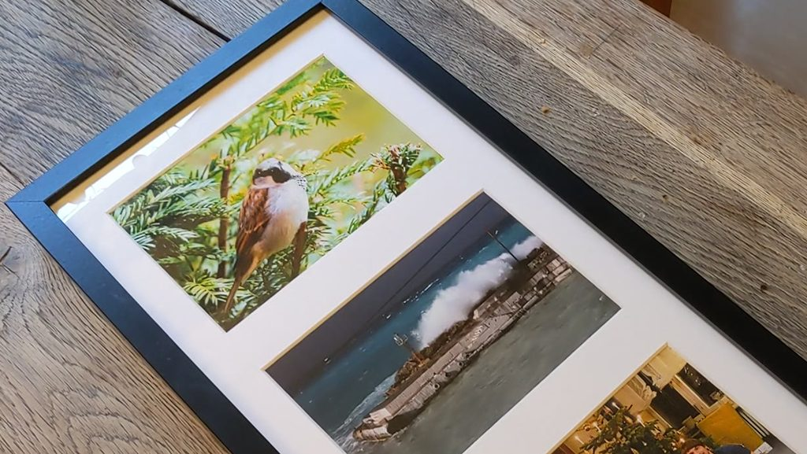
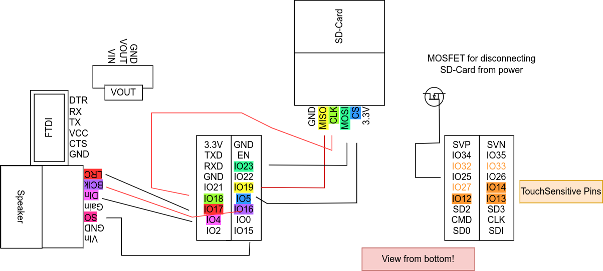
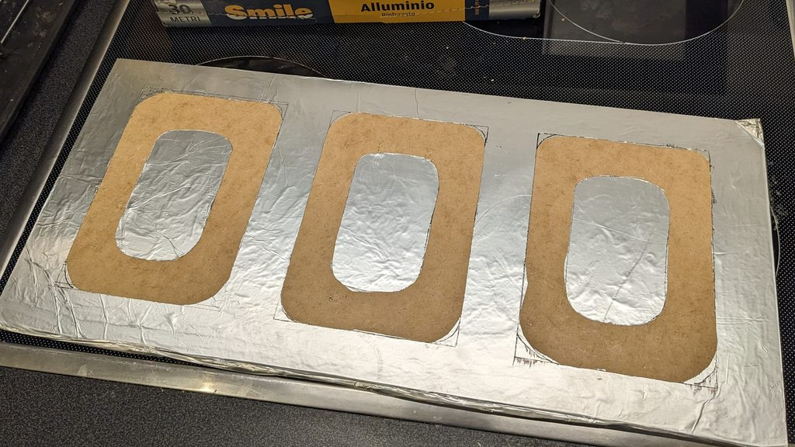
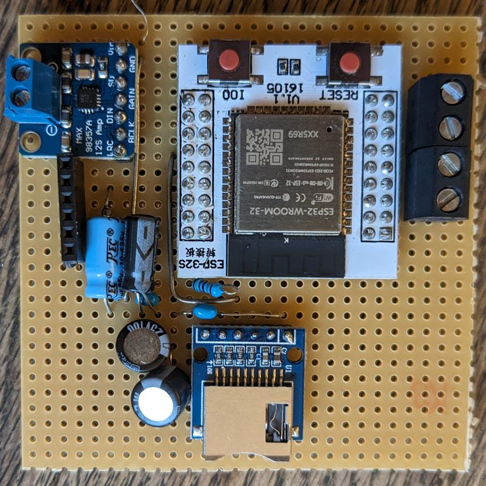
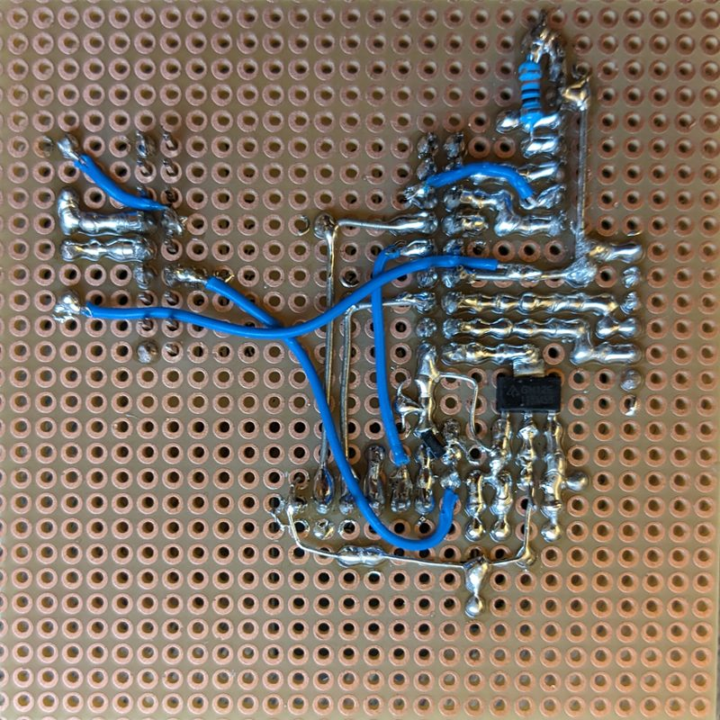

# ImageTouchToSound
This project aims to provide the instructions for building a touch-sensitive multi-picture frame. When the user touches one of the pictures, the frame will play one of several soundfiles, stored on a sd-card.

This project uses the ESP32s touch-capability together with a picture frame, prepared with aluminum-foil to detect a touch.

## Features
* For each picture, a set of sound-files can be played that will be cycled through at each touch
* Easy change of soundfiles by exchange the soundfiles from the sd-card
* Possibility of having more than one set of soundfiles, the set of soundfiles can be changed by a button-press
* Relatively low power consumption, depending on the Voltage-Regulator, a standby-current less than 100 uA can be achieved
* For calibrating the touch-sensors, the real-time values can be monitored via UART.

## Quality of the project
While the code will work reliable. There are some minor issues that I do not like, for example that there is no central config-file. Also, there is a mixture of non-consistent c and c++ style as at first, I wanted to stick with c, but quickly missed features of c++. I consider this project as archived, thus are not planning to improve/clean the rest. 

Possible improvements:
* Make a clean PCB
* Use a P-MOSFET for disconnecting the SD-Card from power instead of the N-MOSFET solution
* Improve wake-up speed from deep-sleep. At startup, all soundfiles are first loaded which leads to a noticeable lack
* Make the choice of the soundfile set permanent, at the moment it is reset after a power loss.
* Code cleaning, central config file and rewrite parts of code to fit in the class based pattern
* Implement battery-check

## Build-Instructions
* clone
* Adapt touchThreshold and pins in touch_esp.cpp
* use platform-IO to download the dependencies and build it, use an FTDI to program it
* place 16-bit (ideally mono) WAV-SoundFiles on an SD-Card:
    * need to be formatted as FAT32
    * The wave-Files need to be placed in a subfolder of: /frame/sound/YOURNAME
    * The filenames must not exceed 50 characters
    * The filenames need to end with .wav
    * The filenames need to start with 
        * a two-digit number starting at 00 that tells to which picture they belong, e.g. all files starting with 00 belong to the first picture 01 to the second picture. Example: 00_FirstSoundForFirstImage.wav 00_SecondSoundForFirstImage.wav ... 01_FirstSoundForSecondImage.wav ...
    

Used components:
* a picture frame, I used the IKEA Ribba
    * aluminum-foil to form the electrodes
* ESP-WROOM-32 together with ESP-32S Adapter Board
* a SD-Card slot
* Voltage Regulator LDL1117S33R  (but the AP2114H-3.3 would result in a lower sleep-current)
* Max98357 for sound output together with an AIYIMA 45MM speaker
* battery holder for three AA-batteries
* pinheaders, ect.

## Impressions

